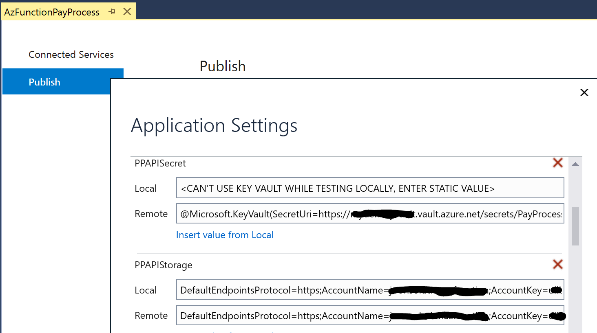

# Azure Durable Functions Payment Processing Sample

Sample Azure Durable Functions using .NetCore 2.1 for Payment Processing of a CSV file with API Secret stored in Azure Key Vault

### Scenario:
- Fan-out/fan-in scenario in Durable Functions

### Diagram:

### Prerequisites:
- Azure Storage Account V2
  - Add the following blob containers
    - inputfiles
    - outputfiles
- Azure Key Vault
  - Add a secret
- Azure Function [Consumption Plan] (Can be create when Publishing from Visual Studio)

### Workflow:
1. This sample monitor an Azure Blob storage container "inputfiles" for new Blob
1. Once a file is drop in the container, the Azure Function will be triggerred automatically, open and read the file content
1. Initiate a Processing Function for each Transaction (Line) (Parallel Processing),
1. Then save all processed transactions into a blob within the "outputfiles" container

### Setup:
- Clone the repository
- Open the project in Visual Studio 2019
- Modify the following entries in each host.json & local.settings.json (If testing locally)
  - <STORAGE ACCOUNT KEY> ex: DefaultEndpointsProtocol=https;AccountName=AZSTACCT;AccountKey=uX...pw==;EndpointSuffix=core.windows.net 
  - <AZURE KEY VAULT SECRET URI> ex: https://AZUREKEYVAULTNAME.vault.azure.net/secrets/SECRETNAME/2a...9
- Configure Azure Key Vault Secret (https://docs.microsoft.com/en-us/azure/app-service/app-service-key-vault-references)
- Build the project
- [Optional] You can run the project locally prior to Publish to Azure (Without KeyVault)
- Publish to Azure Function

### PERMISSIONS REQUIRED FOR THE FUNCTION TO ACCESS THE SECRET IN KEY VAULT: (Azure Functions must exist)
- Apply Azure Key Vault Permissions for the Azure Function to be able to read the Secret 
  - Enable MSI and give it access to the Azure Key Vault
      - In the Azure portal, open your Azure function
      - Browse to Platform Features, then select Identity
      - Under Status, select On, then Save and Accept creating a System Assigned Managed Identity
      - Wait till the creation is completed and Copy the Object ID provided (Needed for the upcoming step)

  - Give the Azure function Managed Identity access to the Secret in Azure Key Vault
      - In the Azure portal, Browse to your Azure Key Vault
      - Select Access Policies, click on Add Access Policy
      - Under Secret Permissions, Select "Get"
      - Click Select Principal and add the Function MSI (Object ID from previous step), click Select, then Add
      - Then Click Save to update the Access Policies

- Review the "Function App Settings" in the portal to confirm the host.json values where deployed accordingly.  

- Enable APP INSIGHTS to watch live metrics while processing.

#### VS2017 Publish Settings Sample Screenshot:

### Operation:
- Drop the included CSV file in the inputfiles container of the storage account
- Watch the Live Metrics in App Insights
- Output file will be saved in the outputfiles container
